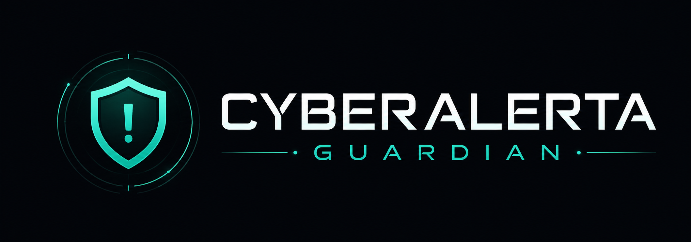
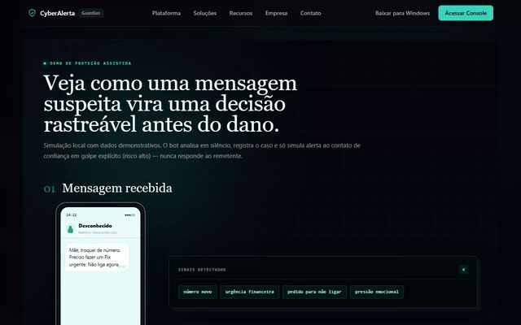
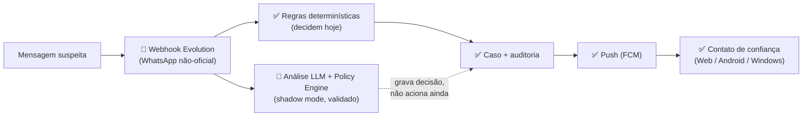

<p align="center">
  
</p>

<h1 align="center">CyberAlerta Guardian</h1>

<p align="center"><b>MVP de proteção assistida contra golpes e engenharia social em mensagens.</b></p>

<p align="center">
  <a href="https://github.com/GabrielArcanjo777/cyberalerta-guardian/actions/workflows/ci.yml"></a>
  
  
  
  
  
  <a href="./LICENSE"></a>
</p>

CyberAlerta Guardian é um MVP que analisa mensagens recebidas em um número de WhatsApp **autorizado**, identifica sinais de risco de golpe (Pix suspeito, link falso, falso banco, parente pedindo dinheiro, código de verificação, urgência/manipulação) e **alerta um contato de confiança** — nunca o remetente. O objetivo é reduzir o tempo de reação da família e organizar casos suspeitos para revisão humana, combinando regras determinísticas explicáveis com uma camada de análise por LLM (ainda em shadow mode) e auditoria completa.

Não é um produto pronto para produção. É um **MVP técnico**, com estado real documentado abaixo — inclusive o que ainda não funciona.

**Licença:** [Elastic License 2.0](./LICENSE) — código-fonte público, disponível para estudo, uso e modificação. Não é open source no sentido estrito (OSI): a única restrição relevante é não oferecer este software como serviço hospedado/gerenciado a terceiros. Ver [seção Licença](#licença).

## Demonstração



Gravado a partir da rota `/assisted-demo` local (simulação self-contained, sem dados reais). Vídeo/roteiro de captura em [`docs/DEMO_GUIDE.md`](docs/DEMO_GUIDE.md) — o fluxo completo com backend real, login e Guardian Console autenticado ainda não foi gravado (ver pendências no guia).

## Por que este projeto existe

Este projeto nasceu de uma situação real: uma tentativa de golpe contra um familiar com pouca familiaridade com tecnologia, em que os golpistas se passaram por uma autoridade e construíram uma situação extremamente convincente — urgência, pressão emocional e uma história difícil de questionar no calor do momento. A tentativa não teve sucesso, mas deixou claro o quanto esse tipo de ataque é calculado contra quem tem menos repertório para desconfiar.

O CyberAlerta Guardian nasceu como resposta técnica a esse problema: uma camada de apoio que analisa mensagens em busca de sinais de risco e dá tempo para a família reagir antes que algo aconteça — sem prometer blindagem, sem substituir o julgamento humano.

## Problema

Golpes digitais por engenharia social exploram pressa, confiança familiar, medo e falsa autoridade. Muitas vítimas só percebem o risco depois de transferir dinheiro, clicar em um link ou enviar um código. O Guardian foca no momento **anterior** ao dano: antes do Pix, antes do clique, antes de enviar senha/código/documento, antes de instalar aplicativo remoto, antes de responder a um contato suspeito.

## Visão geral da solução

1. Um número de WhatsApp autorizado é conectado por QR code.
2. Cadastra-se a pessoa protegida e o contato de confiança.
3. As mensagens recebidas são analisadas em tempo real, **em silêncio** — o bot nunca responde no chat.
4. Conversas normais são descartadas; mensagens suspeitas viram um caso com risco, motivo e ação recomendada.
5. Golpe explícito (risco alto) dispara alerta **somente ao contato de confiança** (simulado por padrão; envio real exige dupla autorização na UI).
6. O responsável revisa e decide (confirmar golpe, falso positivo, resolver) — tudo com consentimento/opt-in, retenção limitada e trilha auditável.

## Estado atual (resultados verificáveis)

Números apurados diretamente no repositório em 2026-07-19, executando os comandos reais (não retirados de documentação antiga):

| Métrica | Resultado | Como foi verificado |
| --- | --- | --- |
| Testes automatizados — backend | **359 passed** (47 suítes) | `pytest app/tests -q`, executado nesta revisão. |
| Testes automatizados — Android Companion | **17/17 passed** | `./gradlew testDevDebugUnitTest`, executado nesta revisão. |
| Typecheck — frontend | **0 erros** | `npx tsc --noEmit`, executado nesta revisão. |
| Lint — frontend | **0 erros/avisos** | `npm run lint` (`eslint . --max-warnings=0`), executado nesta revisão. |
| Testes e2e (Playwright) | 3 specs existem (`access`, `redirect`, `animation`) — **não executados com sucesso nesta revisão** | `npm run test:e2e` falhou por um path incorreto em `playwright.config.ts` (`./venv/...`, o venv real é `.venv`); não coberto pelo CI hoje. |
| Dataset rotulado | 305 mensagens (150 golpe / 155 legítimas), sintético | `backend/data/scam_dataset_v1.jsonl`, ver [`docs/metrics_v1.md`](docs/metrics_v1.md). |
| Precisão do alerta automático (regras, sem LLM) | 100% precisão, 10% recall, 0% FPR | Medido contra o dataset acima — ver métricas completas em [`docs/metrics_v1.md`](docs/metrics_v1.md). |
| CI | 2 jobs (`pytest` backend, `tsc`+`eslint` frontend) | [`.github/workflows/ci.yml`](.github/workflows/ci.yml), badge no topo deste README. |
| Plataformas com build validado | Backend, Web, Android (APK debug), Windows (Tauri, local) | Ver [Limitações atuais](#limitações-atuais) para o que falta em cada uma. |

Análise por LLM/pipeline híbrido: **implementada e testada** contra um LLM real (Sprint 5), mas ainda **não conectada** à decisão de criar caso/notificar — isso é uma decisão de arquitetura em aberto, não uma métrica. Detalhe em [Arquitetura](#arquitetura-resumida).

## Arquitetura resumida

Diagrama completo, com status por componente (✅ implementado e testado · 🚧 implementado com lacunas · 📋 planejado), em [`docs/ARCHITECTURE.md`](docs/ARCHITECTURE.md).



**Regra cardinal: o bot nunca responde ao remetente.** O único destino possível de mensagem de saída é o contato de confiança cadastrado, sempre atrás de um safety gate (simulação/envio real/allowlist).

## Principais funcionalidades

- Análise de mensagem suspeita (`POST /analyze`) com score de risco e sinais explicáveis.
- Motor de regras determinísticas + pipeline híbrido com LLM e Policy Engine (PII sanitizada, anti-prompt-injection, shadow mode por padrão).
- Guardian Console: casos, risco, timeline, feedback do responsável.
- Autenticação local (Argon2id), MFA/TOTP, Google OIDC opcional, RBAC (`admin`/`analyst`/`viewer`/`trusted_contact`), auditoria de login/MFA.
- Multi-tenant inicial (`Organization`), pareamento de dispositivo e push notifications (FCM) com teste de IDOR entre organizações.
- **Android Companion** (Kotlin/Compose): app do contato de confiança, recebe alertas por push, nunca lê o WhatsApp da pessoa protegida.
- **Windows Desktop** (Tauri): casca fina sem backend local, reaproveita o mesmo painel web.
- Canal WhatsApp via Evolution API (não-oficial, pareamento por QR).
- Dataset rotulado próprio (305 mensagens) com harness de métricas rodando o código de produção.

Lista completa (incluindo o que é simulado/demo) em [`docs/ARCHITECTURE.md`](docs/ARCHITECTURE.md).

## Segurança e privacidade

Mecanismos abaixo confirmados diretamente no código nesta revisão:

- **Nunca responde ao remetente** — único destino de saída é o contato de confiança cadastrado (`backend/app/dual_bot/`).
- **Allowlist + dry run** — envio real exige `BETA_REAL_SEND_ENABLED` e allowlist re-pinada ao contato; `DRY_RUN=true` por padrão.
- **Redaction/PII** — sanitização de CPF, cartão, telefone e código antes de qualquer chamada à LLM (`backend/app/hybrid/pii.py`).
- **Anti-prompt-injection** — detecção e evento auditável antes da chamada externa (`backend/app/hybrid/service.py`, `PromptInjectionDetected`).
- **RBAC + MFA/TOTP** — `admin`/`analyst`/`viewer`/`trusted_contact`; Admin API exige MFA ativo (`backend/app/auth/`).
- **Auditoria** — login, logout, MFA, Google OAuth e falhas de autenticação ficam registrados (`/admin/audit-logs`).
- **Validação de webhook** — segredo obrigatório em produção (`EVOLUTION_WEBHOOK_SECRET`, `N8N_WEBHOOK_SECRET`); a aplicação recusa subir em produção sem eles (`backend/app/core/security.py`).
- **Rate limiting** — em memória por processo, em `/analyze`, `/auth/*` e webhooks (`RATE_LIMIT_ENABLED`).
- **STORE_FULL_MESSAGE=false por padrão** — mantém apenas hash e preview curto no estado operacional.
- **IDOR testado entre organizações** — `devices`/`notifications` retornam 404 (não 403) para recursos de outra organização, com teste automatizado.

Nenhum desses mecanismos é absoluto — ver [Limitações atuais](#limitações-atuais). Este projeto **não substitui** orientação jurídica, bancária, policial ou de segurança profissional.

## Decisões de engenharia

- **Por que a LLM não decide sozinha:** LLMs alucinam e são alvo de prompt injection; a decisão de enviar alerta fica com uma Policy Engine determinística e versionada — a LLM é só um insumo estruturado adicional.
- **Por que existem regras determinísticas:** explicabilidade total (todo alerta cita sinais nomeados, não é caixa-preta) e funcionam mesmo sem LLM disponível — é o fallback seguro do sistema.
- **Por que existe um Policy Engine separado:** ponto único, testável e versionado que combina regras + LLM numa decisão auditável (`DISCARD`/`REVIEW`/`AUTO_ALERT`), em vez de espalhar lógica de decisão pelo código.
- **Por que o sistema nunca responde ao possível golpista:** qualquer resposta poderia confirmar que encontrou um alvo "vigiado" ou ser usada contra a própria vítima.
- **Por que existe um contato de confiança em vez de agir sozinho:** o sistema apoia a decisão humana, não a substitui — quem confirma se é golpe de verdade é uma pessoa, com contexto que o sistema não tem.
- **Como falsos positivos/negativos são tratados:** thresholds calibrados com dataset próprio; o alerta automático é deliberadamente conservador (alta precisão, recall baixo sozinho — ver [métricas](docs/metrics_v1.md)); casos de risco médio vão para fila de revisão humana em vez de decisão automática.
- **Por que auditoria e consentimento importam:** o sistema lê mensagens de terceiros — cada decisão precisa ser rastreável (hash de conteúdo, versão de regra/policy, latência), e o uso exige opt-in explícito, nunca monitoramento invisível.

## Tecnologias

**Backend:** Python 3.13, FastAPI 0.136, Pydantic 2.13, Uvicorn, Pytest, SQLite.
**Frontend:** Next.js 16.2, React 18.2, TypeScript, Tailwind CSS, Framer Motion, Playwright.
**Android Companion:** Kotlin 2.0, Jetpack Compose, Retrofit, Firebase Cloud Messaging.
**Windows Desktop:** Tauri 2 (Rust) sobre o build estático do mesmo frontend Next.js.
**CI:** GitHub Actions (pytest backend + typecheck/lint frontend).

## Estrutura do repositório

```text
.
├── backend/          FastAPI — API, motor de risco, auth, devices, notifications (ver docs/ARCHITECTURE.md)
├── frontend/          Next.js — painel web, demo assistida, Guardian Console
├── apps/
│   ├── android-companion/   app do contato de confiança (Kotlin/Compose)
│   └── windows-shell/       casca desktop sem backend local (Tauri)
├── docs/              documentação detalhada (ver docs/README.md)
├── scripts/
├── .env.example
└── README.md
```

## Como executar

Backend e frontend em dois terminais (Windows PowerShell):

```powershell
# Terminal 1 — API
cd cyberalerta-guardian\backend
python -m venv .venv
.\.venv\Scripts\Activate.ps1
python -m pip install -r requirements.txt
python -m uvicorn main:app --reload --port 8000

# Terminal 2 — interface
cd cyberalerta-guardian\frontend
npm ci
npm run dev
```

Acesse `http://localhost:3000/assisted-demo` (demo guiada) e `http://localhost:8000/docs` (Swagger).

Setup completo (Linux/macOS, autenticação/MFA, variáveis de ambiente, Evolution API, Docker, Android, Windows, troubleshooting): [`docs/LOCAL_SETUP.md`](docs/LOCAL_SETUP.md).

## Testes

```bash
# Backend
cd backend && python -m pip install -r requirements-dev.txt && python -m pytest app/tests -q

# Frontend
cd frontend && npm ci && npx tsc --noEmit && npm run lint

# Android Companion
cd apps/android-companion && ./gradlew testDevDebugUnitTest
```

Resultados desta revisão: ver [Estado atual](#estado-atual-resultados-verificáveis) acima.

## Limitações atuais

- **MVP técnico** — sem ambiente público de produção.
- **WhatsApp via Evolution API é integração não-oficial** (WhatsApp Web/Baileys) — risco real de bloqueio do número; não é a API oficial Meta Cloud.
- **Multi-tenant incompleto** — `Organization` existe e isola `devices`/`notifications` (testado), mas `Case`/`ProtectedPerson`/`Guardian` ainda não filtram por organização.
- **Pipeline híbrido (LLM + Policy Engine) não conectado à ação** — grava decisão auditável, mas quem decide criar caso/notificar hoje é só o motor de regras determinísticas.
- **Android e Windows sem assinatura** — builds de desenvolvimento/debug; APK sem release key, instalador Windows sem code signing (SmartScreen alerta o usuário).
- **Persistência só SQLite** no código do backend — Postgres já sobe em `compose.server.yml`, mas apenas para Evolution/n8n, não para o backend.
- **Rate limit e idempotência em memória por processo** — não sobrevivem restart nem múltiplos workers; produção exigiria Redis.
- **Sem observabilidade gerenciada** nem logging estruturado.
- **Sem validação com usuários em escala** — só um teste manual ponta a ponta em dispositivo real por plataforma (Android e Windows).
- **Falsos positivos e negativos existem** — ver [`docs/metrics_v1.md`](docs/metrics_v1.md) para números reais, não estimativas.
- **Dependência de modelo LLM externo** quando a camada híbrida está ativa (shadow mode por padrão, nunca decide sozinha).
- **Testes e2e (Playwright) não confiáveis localmente hoje** — bug de path no `playwright.config.ts`, não coberto pelo CI.
- **Necessita hardening** (segredos, observabilidade, isolamento multi-tenant, assinatura de instaladores) antes de qualquer uso além de demo/piloto controlado.

## Roadmap

- Conectar a decisão híbrida (LLM + Policy Engine) ao fluxo real de criação de caso/notificação.
- Fechar o isolamento multi-tenant (`Case`/`ProtectedPerson`/`Guardian` por `organization_id`).
- Migrar persistência para Postgres em produção; workers assíncronos (Celery) e rate limit/idempotência distribuídos (Redis).
- Assinar os instaladores Windows (code signing) e Android (release key).
- Fechar lacunas de UI do Android Companion (lista de casos, admin de convite) e do Windows Shell (logout no console, deep link de caso).
- Corrigir o path do `playwright.config.ts` e cobrir e2e no CI.
- Observabilidade, logs estruturados, políticas completas de LGPD, provider oficial de WhatsApp com opt-in/compliance.

## Licença

[Elastic License 2.0](./LICENSE). Código-fonte disponível para estudo, uso e modificação — a única restrição relevante é não oferecer este software como serviço hospedado/gerenciado a terceiros. Escolhida por causa da visão de longo prazo do projeto: o núcleo permanece com código público; uma eventual versão cloud gerenciada faz parte dessa visão, ainda não implementada.

## Aviso de uso responsável

Não é produção, **não é ferramenta de espionagem** e só deve ser usado em contas próprias ou com **autorização expressa do titular**. Não substitui banco, polícia, advogado ou canais oficiais, e não promete detecção infalível — identifica sinais de risco e alerta um contato de confiança; a decisão final é sempre humana.

---

Documentação completa: [`docs/README.md`](docs/README.md). Dúvidas técnicas ou de arquitetura: abra uma issue.
