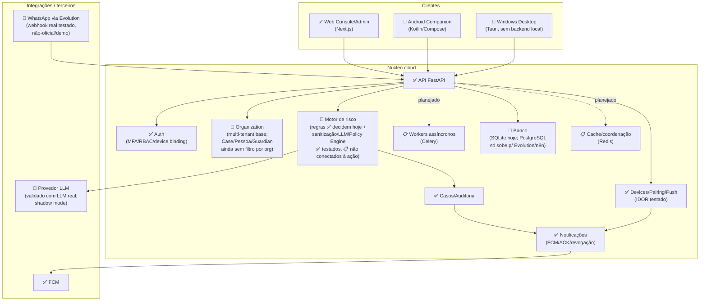
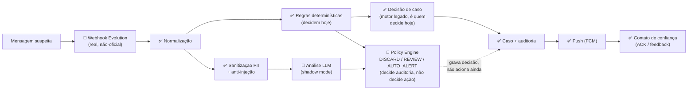

# Arquitetura — CyberAlerta Guardian

Este documento detalha a arquitetura-alvo completa do projeto (Plano Mestre v1.1) e o status real de cada componente, apurado diretamente no código em 2026-07-19. O [README](../README.md) traz apenas a versão resumida.

**Legenda de status:** ✅ implementado e testado · 🚧 implementado, com lacunas conhecidas ou validação parcial · 📋 planejado, ainda não implementado.

## Camadas e componentes



## Fluxo principal (mensagem suspeita → alerta)



## Módulos do backend (`backend/app/`)

```text
backend/
├── main.py
└── app/
    ├── agents/                 análise e decisão do fluxo /analyze
    ├── auth/                   login local, Google OIDC, MFA/TOTP, RBAC, auditoria
    ├── channel_adapters/       contrato adapter-first de canais
    ├── channels/
    ├── consent/                opt-in, escopos e status do bot
    ├── controlled_agents/      agentes controlados do Dual Bot
    ├── core/                   config, segurança, rate limit
    ├── devices/                pareamento de dispositivo confiável (Sprint 2)
    ├── dual_bot/                Bot Protegido e Bot Responsável
    ├── event_model/            eventos, mensagens, casos, risco, Organization (multi-tenant)
    ├── evolution_demo/          provider demo local/controlado
    ├── guardian_console/        console operacional local/demo
    ├── hybrid/                  Policy Engine, sanitização PII, eventos e decisão híbrida
    ├── llm/                     abstração de provedor LLM (OpenAI-compatible + mock)
    ├── mock_whatsapp/
    ├── notifications/          push FCM para o Android Companion (Sprint 2)
    ├── pattern_intelligence/    regras explicáveis e recorrência
    ├── proof_trust/             verificação assistida
    ├── protected_response/
    ├── services/
    ├── storage/                 memory ou SQLite local
    └── trusted_circle/          escalonamento simulado
```

Apps nativos:

```text
apps/
├── android-companion/   app do contato de confiança (Kotlin/Compose) — ver apps/android-companion/BUILD_NOTES.md
└── windows-shell/       casca desktop sem backend local (Tauri) — ver apps/windows-shell/BUILD_NOTES.md
```

## Status detalhado por componente

| Área | Status | Observação |
| --- | --- | --- |
| Backend FastAPI | Implementado | API local com análise, console, canais mock/demo e consentimento. |
| Frontend Next.js | Implementado | Interface demo com Home, `/assisted-demo`, console, intake e telas auxiliares. |
| Guardian Console | Implementado para demo/local | Inclui caso, risco, timeline, feedback e consentimento. |
| Event Model | Implementado em `memory` ou SQLite | Eventos, casos, avaliações e audit log persistem quando `STORAGE_BACKEND=sqlite`. |
| Pattern Intelligence | Implementado com regras | Sem ML pesado e sem IA externa. |
| Pipeline híbrido (regras + LLM + Policy Engine) | Implementado, validado com LLM real, **não conectado à ação** | Desligado e em shadow por padrão. Testado ponta a ponta na Sprint 5 contra um LLM real (OpenRouter): grava decisão (`DISCARD`/`REVIEW`/`AUTO_ALERT`) e auditoria corretamente, inclusive divergência regra×LLM. **Gap conhecido:** essa decisão ainda não decide se um caso é criado ou o responsável é notificado — isso continua 100% do motor de regras determinísticas legado. Prioridade da Sprint 6. |
| Cadastro pessoa protegida + contato de confiança | Implementado | UI em `/whatsapp-setup`, persistido em SQLite, sobrevive restart. |
| Toggles de envio na UI (simulação/envio real) | Implementado | Sem editar `.env`; allowlist re-pinada automaticamente ao contato de confiança. |
| Dataset rotulado + métricas | Implementado | 305 mensagens, harness com código de produção, regressão em testes (`metrics_v1.md`). |
| Testes e2e frontend (Playwright) | Implementado | 3 specs: acesso, redirecionamento de login e reduced motion (`frontend/e2e/`). |
| Agentes controlados | Implementados | Sem agente autônomo livre; LLM externa é opcional e nunca decide envio. |
| Consentimento/opt-in | Implementado como base local | Não é consultoria jurídica nem compliance completo. |
| Autenticação local | Implementado | Login email/senha, cookies HttpOnly, MFA/TOTP, RBAC e auditoria. |
| Google OAuth/OIDC | Implementado como opcional | Desativado por padrão; exige configuração local segura. |
| Persistência | `memory` ou SQLite local | SQLite é opcional via env; não há banco de produção. |
| WhatsApp (Evolution) | Implementado (não-oficial) | Canal via Evolution API/WhatsApp Web (Baileys). Pareamento por QR em `/whatsapp-setup`. Portfólio/demo, não produção; risco de ban do número. |
| n8n/WhatsApp | Parcial/MVP | Endpoint inbound n8n-first para WhatsApp local/controlado; CyberAlerta decide risco e ação. |
| Multi-tenant (`Organization`) | Implementado (base) | `organization_id` em `AuthUser`/`ProtectedPerson`/`Guardian`/`Case`, hoje opcional/retrocompatível. **Gap conhecido:** os repositórios de `Case`/`ProtectedPerson`/`Guardian` ainda não filtram por `organization_id` nas consultas — só `devices`/`notifications` já aplicam isolamento (404, não 403) e têm teste de IDOR entre orgs. |
| Pareamento de dispositivo + Push (FCM) | Implementado | `app/devices/` (convite, pareamento, sessão, revogação) + `app/notifications/` (envio FCM real via HTTP v1, payload restrito a `alert_id/severity/protected_person_alias/deep_link`, nunca o conteúdo bruto). |
| Android Companion | Build validado, piloto em teste real | App Kotlin/Compose em `apps/android-companion/`; 17/17 testes unitários verdes; pareado e testado uma vez em aparelho físico real. Sem assinatura de release, sem UI própria de admin para gerar convite, sem lista de casos no app. |
| Windows Desktop (Tauri) | Build validado localmente | Casca fina em `apps/windows-shell/` (sem backend local): exporta só Console/Admin/MFA/login do Next.js, chama a API via `@tauri-apps/plugin-http`. Sem assinatura de código, sem updater configurado. |
| Workers assíncronos (Celery) | Planejado | Não há nenhuma dependência ou módulo Celery no código hoje. |
| Persistência PostgreSQL | Planejado | Só SQLite tem suporte real no código do backend. Postgres já sobe em `compose.server.yml`, mas apenas para Evolution/n8n. |
| Cache/coordenação (Redis) | Planejado | Rate limit e idempotência hoje são em memória por processo. |
| Produção | Não pronta | Falta fechar IDOR multi-tenant, migrar persistência para Postgres, observabilidade gerenciada, rate limit/idempotência distribuídos e assinatura dos instaladores Windows/Android. |

## Funcionalidades implementadas (lista completa)

- Análise de mensagem suspeita via `POST /analyze`, score de risco e sinais explicáveis.
- Trust Lock como recomendação de pausa protetiva; Agent Decision Trace para explicar decisões; recovery checklist pós-incidente.
- Simple Channel mock, Mock WhatsApp Adapter, Channel Adapter Contract adapter-first, Evolution Demo Adapter.
- Dual Bot Flow: Bot Protegido (nunca responde ao remetente) + Bot Responsável (alerta só o contato de confiança) + feedback auditável.
- Pipeline híbrido de detecção (regras + LLM + Policy Engine): abstração de provedor LLM (OpenAI-compatible/OpenRouter) com mock para testes, Policy Engine determinística e versionada (DISCARD/REVIEW/AUTO_ALERT), sanitização de PII e proteção contra prompt injection antes da chamada externa, shadow mode por padrão, trilha de auditoria com hash de conteúdo/versões/latência (sem secrets).
- Cadastro do número da pessoa protegida + contato de confiança na UI, com persistência; toggles de simulação (DRY_RUN) e envio real (beta) direto na UI, com allowlist automática.
- Dataset rotulado (305 mensagens) + harness de métricas rodando o código de produção; testes e2e do frontend com Playwright.
- Sanitização de conteúdo exibido no frontend; acessibilidade de animações (`prefers-reduced-motion`).
- Idempotência inbound com TTL e limite de tamanho no registro em memória.
- Fail-fast de produção: a aplicação não sobe com `APP_ENV=production` sem `RATE_LIMIT_ENABLED=true` e `EVOLUTION_WEBHOOK_SECRET` definidos.
- Event Model com eventos, casos, mensagens e risk assessments; Pattern Intelligence rule-based.
- Agentes controlados: `TriageAgent`, `ResponsibleAlertAgent`, `CaseSummaryAgent`, `PatternReviewAgent`.
- Guardian Console real/local: lista de casos, caso ativo, pessoa protegida, responsável vinculado, risco e sinais, timeline, feedback, ações do responsável, status de consentimento.
- Consentimento/opt-in local com ativar, desativar, revogar e escopos.
- Autenticação local por email/senha (Argon2id), sessão em cookie HttpOnly SameSite=Lax, MFA/TOTP, Google OAuth/OIDC opcional com state anti-CSRF e validação de issuer/audience/email verificado, RBAC (`admin`/`analyst`/`viewer`/`trusted_contact`).
- Admin API (`/admin/users`, `/admin/audit-logs`), script `create_admin.py`, auditoria de login/logout/MFA/Google/falhas, rate limit básico em memória, storage em memória ou SQLite, headers básicos de segurança, API key opcional.
- Devices/pairing/push: convite de pareamento, pareamento por token de uso único, sessão de dispositivo, revogação, push FCM real via HTTP v1, ACK de alerta, teste de IDOR entre organizações.

## Funcionalidades simuladas ou demo

- Trusted Circle não envia SMS, WhatsApp ou e-mail real.
- Mock WhatsApp não se conecta ao WhatsApp real.
- Evolution API é canal não-oficial (WhatsApp Web/Baileys) para portfólio/demo.
- Guardian Console usa dados locais/in-memory ou SQLite local.
- Proof of Trust é checklist assistido, não valida identidade automaticamente.
- Pattern Intelligence usa regras explicáveis, não modelo treinado.
- Agentes são orquestradores controlados, não agentes autônomos.
- Consentimento é base técnica de opt-in, não implementação jurídica completa.

## Pipeline híbrido de detecção — como decide

Combina três camadas para decidir se um alerta ao contato de confiança deve ser enviado. **A LLM é apenas um insumo estruturado** — só a Policy Engine (determinística e versionada) e o safety gate decidem envios. A LLM nunca chama o adapter de WhatsApp nem decide sozinha.

```text
Mensagem → Regras determinísticas ─┐
                                    ├→ Policy Engine → DISCARD | REVIEW | AUTO_ALERT
           Análise LLM ────────────┘                                       │
                                                              Contato de confiança
                                                            (via safety gate existente)
```

- **DISCARD**: score baixo, sem sinais fortes, LLM benigna concordante.
- **REVIEW**: LLM indisponível, conflito regras×LLM, faixa intermediária, injeção suspeita, saída inválida ou evidência insuficiente. **Default seguro.**
- **AUTO_ALERT**: só com `classification=SCAM`, `confidence>=0.85`, score determinístico `>=65`, ≥2 sinais objetivos, concordância e uma combinação de risco (A/B/C/D). A LLM sozinha **nunca** autoriza; regras sozinhas **nunca** autorizam.

### Config padrão segura

| Variável | Padrão | Efeito |
| --- | --- | --- |
| `HYBRID_LLM_ENABLED` | `false` | LLM não é chamada; roda só determinístico. |
| `HYBRID_LLM_SHADOW_MODE` | `true` | Grava a decisão que seria tomada; **nunca envia** por causa do híbrido. |
| `HYBRID_REQUIRE_LLM_FOR_AUTO_ALERT` | `true` | LLM indisponível ⇒ máximo `REVIEW`. |
| `HYBRID_REDACT_PII` | `true` | Redige cartão/CPF/telefone/código antes da LLM. |

**Rollback:** `HYBRID_LLM_ENABLED=false` (ou `SHADOW_MODE=true`) — o fluxo volta ao comportamento determinístico atual sem qualquer alteração de código.

Cada análise grava eventos (`DeterministicAssessmentCreated`, `LLMAnalysis*`, `HybridDecisionCreated`/`Shadow`, `ReviewQueued`, `AutoAlertAuthorized`/`Blocked`, `PromptInjectionDetected`, `PolicyFallbackUsed`) com metadados auditáveis: hash do conteúdo, scores, versões de prompt/policy, provider/modelo, motivos curtos e latência. **Nunca** grava API key, prompt, chain-of-thought ou o conteúdo integral.

## Aplicativos Companion (Android e Windows)

Dois clientes nativos que **não têm lógica de decisão própria** — a nuvem (FastAPI) continua sendo o cérebro; eles só autenticam, exibem o Console e recebem/confirmam alertas.

### Android Companion (`apps/android-companion/`)

App do **contato de confiança** — nunca lê o WhatsApp da pessoa protegida, só recebe alertas autorizados via push (FCM) e confirma ações. Kotlin + Jetpack Compose, product flavors `dev`/`staging`/`prod` com application ids e Firebase projects separados. Build validado de verdade (`assembleDevDebug`, 17/17 testes unitários), pareado e testado uma vez em aparelho físico contra o backend real. Pendências conhecidas antes de distribuir: assinatura de release (hoje é APK de debug), UI de admin para gerar convite de pareamento (hoje é via API direta), lista de casos/alertas no app. Detalhes em `apps/android-companion/BUILD_NOTES.md`.

### Windows Desktop (`apps/windows-shell/`)

Casca Tauri fina, **sem backend local**: exporta estaticamente só as rotas `login`/`mfa`/`admin`/`family-console`/`whatsapp-setup` do mesmo frontend Next.js (não duplica lógica), chama a API da nuvem via `@tauri-apps/plugin-http` (roda fora do CORS/CSP/SameSite do navegador). Tray icon, deep link `cyberalerta://`, fechar minimiza em vez de matar o processo. Pendências conhecidas: sem assinatura de código (SmartScreen vai alertar o usuário), sem updater configurado, cookie jar de sessão não criptografado em disco, `cyberalerta://case/{id}` ainda não abre o caso específico. Detalhes em `apps/windows-shell/BUILD_NOTES.md`.

## Deploy de referência (piloto)

Guia completo em [`server-deployment.md`](./server-deployment.md): `compose.server.yml` roda `frontend` + `backend` atrás de um Cloudflare Tunnel, com Postgres/Redis reservados hoje para Evolution/n8n (o backend em si ainda usa SQLite). Não é infraestrutura de produção multi-tenant.
